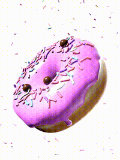

# Donut-Blender

This is my first Blender project, a basic model of a donut, created by following the popular Donut Tutorial by Blender Guru on YouTube. It serves as a starting point to showcase my progress and learning in Blender.

## Project Description

The Blender Donut Project is a 3D model created using Blender, following the step-by-step instructions provided in the Donut Tutorial by Blender Guru. The project focuses on teaching the fundamentals of Blender, including modeling, texturing, lighting, and rendering. The result is a realistic-looking donut with icing and sprinkles.

## Features

- Basic 3D model of a donut with icing and sprinkles
- Realistic materials and textures applied to the model
- Proper lighting setup to enhance the overall look of the scene
- Rendered animation showcasing the final result of the project

## Getting Started

To explore or work with the project, follow these steps:

1. **Prerequisites**: Ensure that you have Blender installed on your computer. The project was created using Blender 3.4.1.

2. **Clone the Repository**: Clone this repository to your local machine using Git or download it as a ZIP file and extract it.

3. **Open the Project**: Open Blender and select "Open" or "Open Recent". Navigate to the project directory and select the file containing the Blender Donut Project.

4. **Explore the Scene**: The project file contains the 3D scene with the donut model, materials, and lighting setup. Feel free to navigate the scene, inspect the model, and modify any aspects as desired.

5. **Render the Scene**: You can render the scene to see the final result. Adjust the render settings, resolution, or other parameters as needed. Experiment with different lighting setups or camera angles to create your unique renders.

## Future Improvements

This project is a starting point for learning Blender, and there are several areas where it can be expanded or enhanced, including:

- Adding additional objects or elements to the scene to create a more complex composition
- Experimenting with different textures, shaders, or materials to customize the look of the donut
- Exploring advanced techniques in Blender, such as animation, physics simulations, or character modeling
- Incorporating the donut model into a larger scene or project
- Sharing renders or animations created with the donut model on social media or portfolio websites

## Acknowledgments

This project is based on the Donut Tutorial by Blender Guru. I would like to express my gratitude to Blender Guru for providing such a comprehensive and beginner-friendly tutorial, which helped me learn the basics of Blender.
